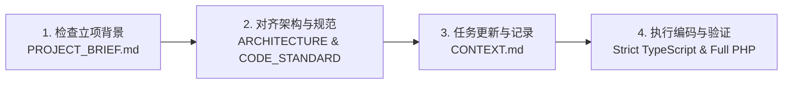

# AGENTS.md - AI Agent 统一交互与执行协议
> 🤖 本文件是专为 AI 编程助手（如 Cursor, Windsurf, Claude Code, Copilot, Antigravity, DeepSeek 等）定制的**核心行为宪法**。
> 当开发者在这个脚手架上开展新项目时，AI Agent **必须在每次会话开始时严格遵守本规范**。

---

## 🧭 AI 黄金工作流（Golden Workflow）

AI Agent 在响应用户任何需求时，必须按以下 **4 步流水线** 依次执行：

### 第一步：检查立项与需求对齐
* **动作**：首先读取根目录的 `PROJECT_BRIEF.md`。
* **判断**：
  * 若该文件为空或模板占位符未填充：**暂停直接写业务代码，主动引导用户完成项目立项问答**，并将讨论结果更新至 `PROJECT_BRIEF.md`。
  * 若已完成立项：基于该文件中的业务领域实体、功能模块与角色边界进行后续开发。

### 第二步：架构边界守则
* **严格遵守全栈 PHP 双后端与前端边界**：
  * **ThinkPHP 8 (`tp8-admin`)**：负责用户鉴权、RBAC 权限、业务主数据 CRUD、数据库事务、操作日志。禁止在 TP8 中写长连接或流式输出。
  * **Hyperf 3.x (`hyperf-service`)**：负责 AI 接入、流式 SSE、长连接 WebSocket、文件深度解析、异步高性能计算任务。**只负责通过 JWT Secret 验证 Token，不负责用户权限维护**。
  * **React Web (`react-web`)**：纯静态 SPA，开启 TS `strict: true`，所有接口必须强类型化定义，严禁滥用 `any`。

### 第三步：上下文同步
* **动作**：读取并更新 `CONTEXT.md`。
* **原则**：任何重要的技术决策变更、新增/完成的 Todo 事项，必须同步追加到 `CONTEXT.md`，保证多轮会话上下文不丢失。

### 第四步：编码与自检
* 编写代码前阅读 `CODE_STANDARD.md` 与 `API_SPEC.md`。
* 确保所有代码风格一致，文件分层规范，错误处理完善。

---

## 🚫 AI 绝对禁止项（Forbidden Rules）

1. ❌ **禁止破坏前后端分离**：后端禁止使用 Blade/ThinkTemplate/Blade 输出 HTML 视图，只能输出标准 JSON 或 SSE 流。
2. ❌ **禁止私自合并后端或替换技术栈**：严禁将 TP8 + Hyperf 双后端合并为单体，或将 React 替换为 Vue，或将 Zustand 替换为 Redux。
3. ❌ **禁止在前端关闭 `strict` 或滥用 `any`**：前端必须保持 TS 严格模式，所有接口入参和出参必须有 `interface` 或 `type`。
4. ❌ **禁止在 Controller 堆砌业务逻辑**：必须遵循 Controller $\rightarrow$ Service $\rightarrow$ Model 分层架构。
5. ❌ **禁止在 Hyperf 中使用非协程阻塞调用**：Hyperf 中必须使用协程安全的驱动（连接池、Guzzle 协程客户端、Redis 协程驱动）。
6. ❌ **禁止私自创建非标准目录**：shadcn/ui 组件只能位于 `src/components/ui`，业务组件位于 `src/components/common`。

---

## 📋 常见场景指令速查（AI Action Patterns）

| 场景 | AI 标准执行流程 |
| :--- | :--- |
| **新增 TP8 业务模块** | 1. 定义数据表迁移/SQL $\rightarrow$ 2. 创建 Model $\rightarrow$ 3. 创建 Validate $\rightarrow$ 4. 编写 Service 逻辑 $\rightarrow$ 5. 创建 Controller $\rightarrow$ 6. 注册 `route/admin.php` |
| **新增 Hyperf AI/流式接口** | 1. 在 `app/Request/` 定义 DTO $\rightarrow$ 2. 编写 `app/Service/` 协程异步逻辑 $\rightarrow$ 3. 创建 Controller 并注入 JWT 中间件 $\rightarrow$ 4. 注册到 `config/routes.php` |
| **新增前端页面** | 1. 在 `src/types/` 定义强类型 $\rightarrow$ 2. 在 `src/api/` 封装请求函数 $\rightarrow$ 3. 在 `src/pages/` 编写页面 $\rightarrow$ 4. 注册路由并在动态菜单中映射 |
