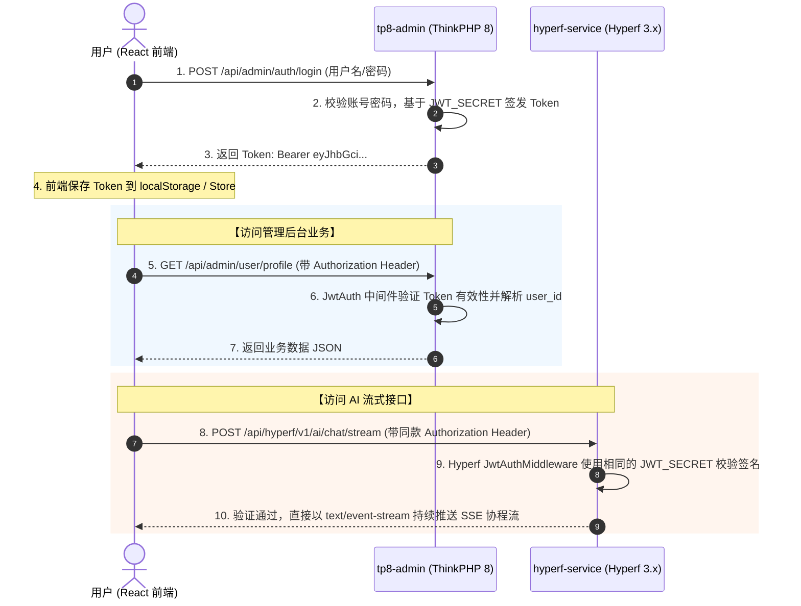

# ARCHITECTURE.md - 系统架构与拓扑规范

> 本文档详细阐述了 ThinkPHP8 + Hyperf 3.x + React18 纯 PHP 双后端全栈架构的数据流转、网络拓扑、鉴权机制与模块职责划分。

---

## 1. 🏗️ 系统整体架构图

```
                        ┌──────────────────────────────────────────────┐
                        │              Browser (Client)                │
                        │   React 18 + TS (strict) + shadcn/ui (SPA)   │
                        └──────────────────────┬───────────────────────┘
                                               │
                                       HTTP / HTTPS / SSE
                                               │
                                               ▼
                        ┌──────────────────────────────────────────────┐
                        │                 Nginx Gateway                │
                        │           Port: 80 / 443 (Reverse Proxy)     │
                        └──────┬───────────────────────┬───────────────┘
                               │                       │
           Path: /api/admin/*  │                       │  Path: /api/hyperf/*
                               ▼                       ▼
            ┌────────────────────────────┐   ┌────────────────────────────┐
            │       tp8-admin            │   │      hyperf-service        │
            │      (ThinkPHP 8)          │   │      (Hyperf 3.x/Swoole)   │
            │   Port: 8001 / PHP-FPM     │   │   Port: 9501 / Coroutine   │
            ├────────────────────────────┤   ├────────────────────────────┤
            │ • 用户认证 & JWT 签发      │   │ • AI 对话 & SSE 流式输出   │
            │ • RBAC 菜单权限控制        │   │ • WebSocket 实时双向通信   │
            │ • 业务数据主事务 CRUD      │   │ • 协程异步高并发任务       │
            │ • 系统审计与操作日志       │   │ • 大文件流式解析 & 统计    │
            │ • 传统 FPM 稳定模型        │   │ • JWT 中间件独立校验       │
            └──────────────┬─────────────┘   └──────────────┬─────────────┘
                           │                                │
                           │           Shared Auth          │
                           ├────────────────────────────────┤
                           │                                │
                           ▼                                ▼
            ┌────────────────────────────┐   ┌────────────────────────────┐
            │          MySQL 8           │   │            Redis           │
            │        (主业务数据)        │   │  (缓存/JWT黑名单/任务队列) │
            └────────────────────────────┘   └────────────────────────────┘
```

---

## 2. 🌐 网络拓扑与路由分发规则

无论是本地 Vite 代理还是生产 Nginx 网关，均严格保持统一的 URI 路由命名空间：

| 路由前缀 | 目标服务 | 协议/特性 | 业务职责 |
| :--- | :--- | :--- | :--- |
| `/` | `react-web` | HTTP/HTTPS | 前端静态页面（SPA，History 路由回退到 index.html） |
| `/api/admin/*` | `tp8-admin` | HTTP JSON | 用户登录、组织架构、RBAC 权限、业务表单 CRUD |
| `/api/hyperf/*` | `hyperf-service`| HTTP / SSE / WS | AI 推理、文本嵌入向量、流式打字机输出、实时任务 |

---

## 3. 🔐 统一无状态 JWT 鉴权流程

为了兼顾微服务解耦与高性能，本系统采用 **共享 Secret 的无状态 JWT 鉴权**：



### 鉴权设计亮点：
* **全 PHP 原生解耦**：两套服务均使用标准 `firebase/php-jwt` 库，编码逻辑统一。
* **零 RPC 延迟**：Hyperf 不需要反向调用 TP8 查询用户状态，直接在本地解密验证 Token 签名。
* **双端互认**：前端用户只需登录一次，生成的 Token 同时具备访问两套后端的通行凭证。

---

## 4. 📦 各子系统职责边界

### (1) `tp8-admin` (ThinkPHP 8)
* **定位**：业务中枢与权限基石。
* **必须负责**：用户登录、密码重置、角色权限（RBAC）、动态菜单树、核心业务数据库表操作、ACID 事务控制、附件上传存储、操作日志。
* **严禁负责**：长连接、WebSocket、SSE 流式输出、高并发 CPU 密集型分析。

### (2) `hyperf-service` (Hyperf 3.x)
* **定位**：高性能协程计算与智能流式引擎。
* **必须负责**：大模型（OpenAI/Claude/DeepSeek/Local LLM）转发与 SSE 流式输出、WebSocket 双向通信、大文件异步解析、异步任务队列。
* **严禁负责**：用户账号维护、RBAC 角色权限体系（只读验证 JWT 中的用户上下文）。
* **技术约束**：全链路采用 Swoole/Swow 协程驱动与连接池，严禁使用非协程阻塞调用。

### (3) `react-web` (React 18 + Vite + TS Strict + shadcn/ui)
* **定位**：现代企业级 SPA 前端。
* **必须负责**：交互渲染、路由鉴权保护（Auth Guard）、动态侧边栏菜单生成、统一错误 Toast 提示、AI 流式打字机组件渲染。
* **技术约束**：全局强制开启 TypeScript 严格模式 (`strict: true`)，杜绝 `any`。
