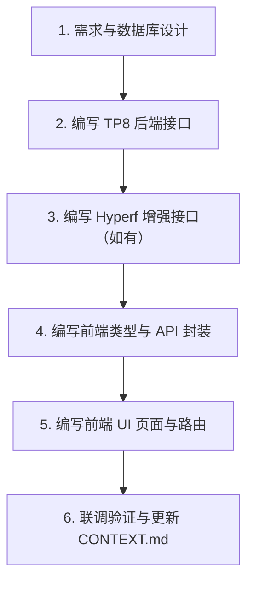

# DEVELOP_GUIDE.md - 本地开发与 AI 开发指南

> 本文档指导开发者或 AI 助手在本地进行项目开发、新增功能及联调测试。

---

## 1. 🛠️ 本地环境准备与启动流程

### 第一步：启动基础中间件（MySQL + Redis）
可使用 Docker Compose 快速拉起本地数据库与缓存服务：
```bash
docker compose up -d mysql redis
```

### 第二步：启动 `tp8-admin` (端口: 8001)
```bash
cd tp8-admin
# 1. 安装 Composer 依赖
composer install

# 2. 复制环境配置文件
cp .env.example .env

# 3. 启动本地开发内置服务器
php think run -p 8001
```

### 第三步：启动 `hyperf-service` (端口: 9501)
> 提示：Hyperf 需要 Swoole 或 Swow 扩展环境。如果在 Windows 原生环境无 Swoole，可直接使用 `docker compose up -d hyperf-service` 运行。
```bash
cd hyperf-service
# 1. 安装 Composer 依赖
composer install

# 2. 复制环境配置文件
cp .env.example .env

# 3. 启动 Hyperf 服务
php bin/hyperf.php start
```

### 第四步：启动 `react-web` (端口: 5173)
```bash
cd react-web
# 1. 安装前端依赖
npm install

# 2. 启动 Vite 开发服务
npm run dev
```

打开浏览器访问 `http://localhost:5173` 即可进入系统。

---

## 2. 🤖 AI Agent 开发新功能 SOP (标准操作程序)

当用户向 AI 提出新增业务功能时（例如：“*请帮我添加一个客户管理模块*”），AI 必须严格按照以下顺序执行：



### 步骤清单：
1. **数据层**：设计 MySQL 表结构，编写 SQL 迁移脚本或更新 `docker/mysql/init.sql`（遵循 `CODE_STANDARD.md` 第 4 节）。
2. **TP8 端**：
   - 创建 Model: `tp8-admin/app/admin/model/Customer.php`
   - 创建 Validate: `tp8-admin/app/admin/validate/CustomerValidate.php`
   - 创建 Service: `tp8-admin/app/admin/service/CustomerService.php`
   - 创建 Controller: `tp8-admin/app/admin/controller/CustomerController.php`
   - 注册路由: `tp8-admin/route/admin.php`
3. **Hyperf 端（若涉及 AI 分析 / 流式输出）**：
   - 在 `hyperf-service/app/Controller/` 增加对应的分析/流式端点并注册路由。
4. **前端**：
   - 在 `react-web/src/types/` 中定义该模块的接口 TS 规范。
   - 在 `react-web/src/api/` 中封装 Axios 请求函数。
   - 在 `react-web/src/pages/` 中开发页面。
   - 在 `react-web/src/router/` 中配置页面路由。
5. **记录更新**：在 `CONTEXT.md` 中将对应任务标记为已完成。

---

## 3. 🧭 RBAC 权限与动态菜单映射规范 (RBAC & Dynamic Routing)

为了保证前后端权限与菜单的一致性，系统遵循以下映射机制：

### (1) 后端菜单数据结构 (`sys_menus`)
TP8 的 `/user/menus` 接口返回用户有权查看的树形菜单：
```json
[
  {
    "id": 10,
    "parentId": 0,
    "title": "客户管理",
    "path": "/customer",
    "component": "pages/customer/index",
    "icon": "Users",
    "sort": 1
  }
]
```

### (2) 前端路由与侧边栏映射策略
1. **静态路由注册 + 动态侧边栏渲染（推荐方案）**：
   - 前端所有页面的物理路由在 `src/router/index.tsx` 中预先注册或通过 `React.lazy` 懒加载。
   - 侧边栏菜单（`Sidebar.tsx`）根据 `/user/menus` 接口返回的数据动态过滤与渲染，用户只看到其有权限的菜单项。
2. **按钮级别权限**：
   - 按钮级权限标识定义格式为 `模块名:操作名`（例如：`customer:create`, `customer:delete`）。
   - 前端通过用户角色与权限列表进行控制，或在业务 API 层由 TP8 JwtAuth 中间件统一拦截。
